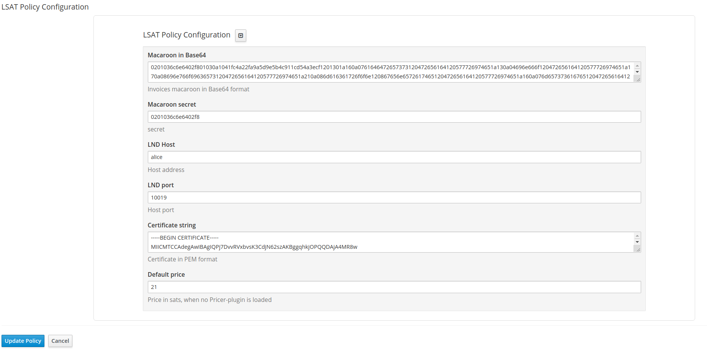

LSAT Lightning Policy plugin
=
This [Apiman](https://www.apiman.io/latest/) plugin provides authentication based on the [LSAT specification](https://docs.lightning.engineering/the-lightning-network/lsat).  
Currently only LND lightning node is supported.

LSAT
-
This plugin provides the native LSAT-specification and a proprietary 'Boltwall' flow.
LSAT is based on the invoice pre-image, this pre-image is proof which only the payer receives after invoice payment.

Boltwall flow
-
[Boltwall](https://github.com/Tierion/boltwall) does not use a pre-image, but an additional request to sign a challenge (related to the paymentHash) by the lightning node.
This signature can be verified by the resource owner, and counts also as proof that the invoice has been paid.
The benefit of this flow is that the wallet, which paid the invoice, is primarily a mobile wallet and is not connected to the browser.
The additional round-trip is therefore required, because the browser does not have access to the pre-image.

- LSAT is useful for server-to-server api usage, connected to a local Lighting Wallet/Node.
- [WebLN](https://webln.dev/) is useful when a Lighting wallet is integrated by a browser extension/plugin. (e.g. [Joule](https://lightningjoule.com/))
- Boltwall is useful in a browser without an extension, but an external/mobile Lighting wallet 

TODO
-
Pricer plugin to provide the satoshi price per request