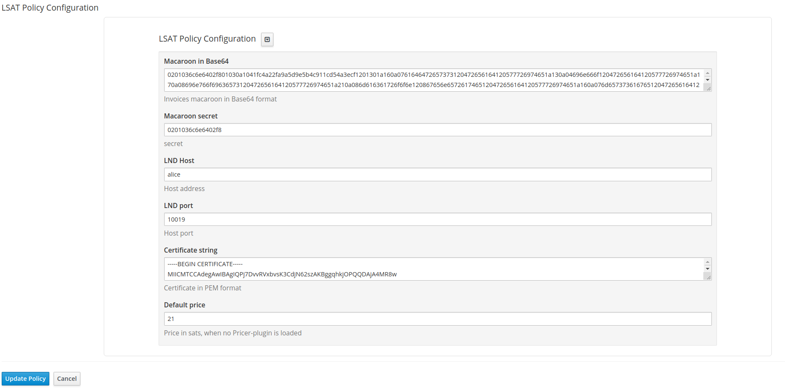

LSAT Lightning Policy plugin
=
This [Apiman](https://www.apiman.io/latest/) plugin provides authentication based on the [LSAT specification](https://docs.lightning.engineering/the-lightning-network/lsat).  
Currently only LND is supported.

TODO
-
Pricer plugin to provide the satoshi price per request